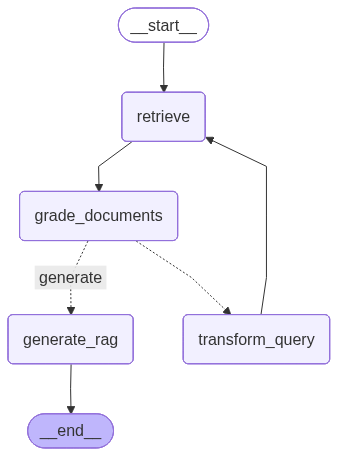

# Lore Compendium - Discord AI Chatbot

Lore Compendium is an AI-powered Discord bot that can answer questions about your documents! Whether you have lore books, PDFs, Word documents, or spreadsheets, this bot will search through them and provide intelligent answers.

**Supported file formats:** .docx, .pdf, .xlsx, .csv, .txt, .md

---

## 🚀 Quick Start (For Beginners)

**Don't know how to code? No problem!** Follow these simple steps:

### Step 1: Install Requirements
You need two programs installed on your computer:
- **Python 3.13** - Download from [python.org](https://www.python.org/downloads/)
  - ✅ On Windows: Check "Add Python to PATH" during installation!
- **Ollama** - Download from [ollama.com](https://ollama.com/download)
  - Windows: Run the installer
  - Mac: Use `brew install ollama` or download from website
  - Linux: Run `curl -fsSL https://ollama.com/install.sh | sh`

### Step 2: Get a Discord Bot Token
1. Go to [Discord Developer Portal](https://discord.com/developers/applications)
2. Click "New Application" and give it a name
3. Go to the "Bot" section
4. Click "Reset Token" and copy the token (you'll need this later!)
5. Enable "Message Content Intent" under Privileged Gateway Intents
6. Go to OAuth2 → URL Generator, select "bot", then select permissions and invite to your server

### Step 3: Run Setup
**Windows:** Double-click `setup.bat`
**Mac/Linux:** Open Terminal in this folder and run `./setup.sh`

The setup will:
- Install all needed software libraries
- Download AI models (may take 10-20 minutes)
- Guide you through configuration

### Step 4: Add Your Documents
Put your documents (PDFs, Word docs, etc.) in the `input` folder.

### Step 5: Start the Bot!
**Windows:** Double-click `start.bat`
**Mac/Linux:** Run `./start.sh`

That's it! Your bot is now running. Go to Discord and message it!

📖 **Need more help?** See [BEGINNER_GUIDE.md](BEGINNER_GUIDE.md) for detailed instructions.

---

## Features

- **Conversational AI**: Customizable personality powered by local LLM models via Ollama
- **Document Search**: RAG (Retrieval-Augmented Generation) system for querying local documents
- **Discord Commands**:
    - `$lore <query>` - Search local documents
    - Direct messages or mentions trigger conversational responses
- **Live Document Sync**: Automatically detects when you add/change documents
- **Privacy First**: Everything runs locally on your computer - no cloud services needed!

## Architecture

The bot uses a LangGraph-based agent system with:

- **Conversation Node**: Handles user queries with tool access
- **ChromaDB**: Stores document embeddings for fast semantic search
- **Ollama**: Provides local AI models

Document Engine Diagram:



---

## Advanced Setup (For Developers)

If you prefer manual installation or want to customize the setup:

### Prerequisites

1. **Python 3.13** - [python.org](https://www.python.org/downloads/)
2. **Ollama** - [ollama.com](https://ollama.com/download)

### Manual Installation Steps

1. **Clone the repository:**
```bash
git clone <repository-url>
cd LoreCompendium
```

2. **Create and activate virtual environment:**
```bash
# Create venv
python -m venv .venv

# Activate - Windows
.venv\Scripts\activate

# Activate - Mac/Linux
source .venv/bin/activate
```

3. **Install dependencies:**
```bash
pip install -r requirements.txt
```

4. **Download Ollama models:**
```bash
cd modelfiles
ollama create -f gpt-oss-20b-modelfile.txt gpt-oss
ollama create -f llama3.2-modelfile.txt llama3.2
ollama pull mxbai-embed-large
cd ..
```

5. **Create config.json:**
```json
{
  "discord_bot_token": "your_token_here",
  "role_description": "Bot personality description",
  "thinking_ollama_model": "gpt-oss",
  "fast_ollama_model": "llama3.2",
  "embedding_model": "mxbai-embed-large"
}
```

6. **Add documents to `input/` folder**

7. **Run the bot:**
```bash
python discord_main.py
```

## License

See repository for license information.

## Contributing

Contributions are welcome! Please open an issue or pull request.
